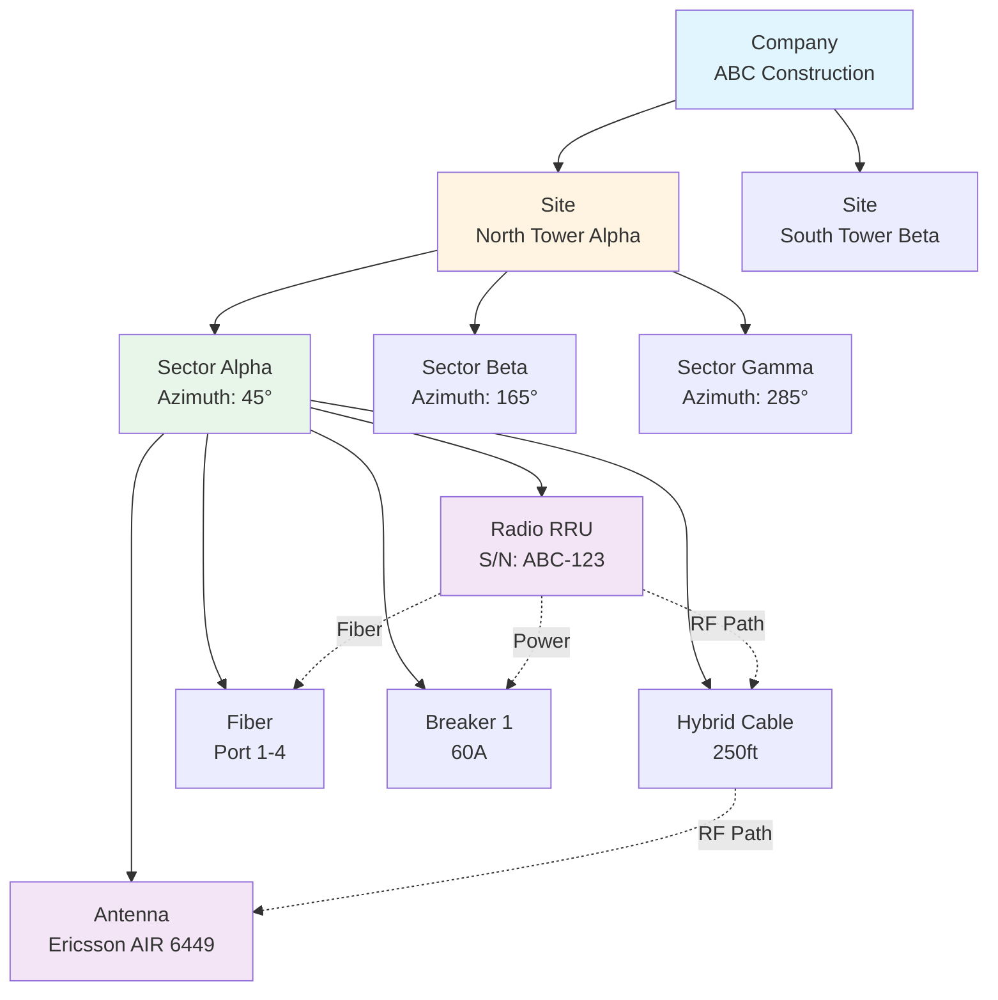
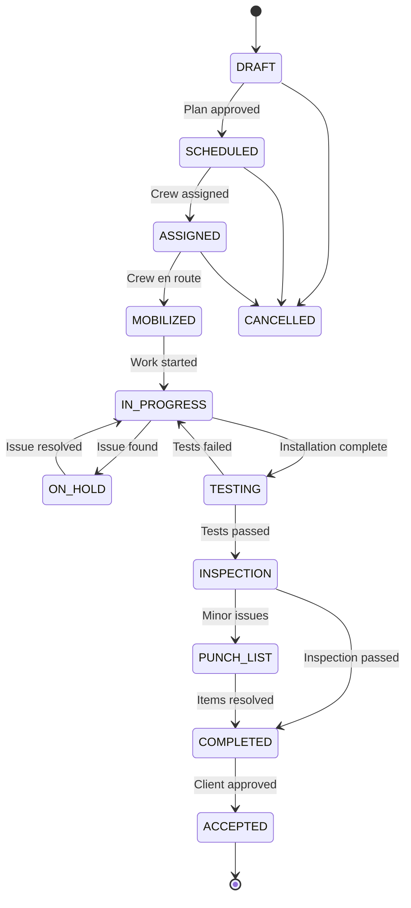
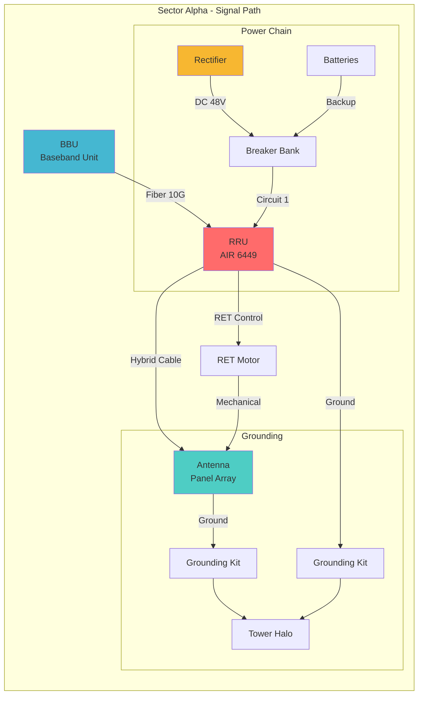
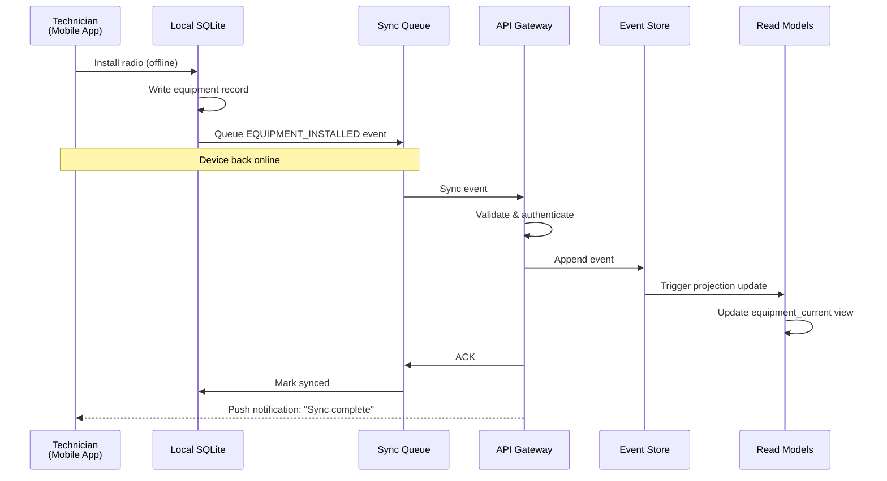

# TowerOS Entity Relationship Diagram

**Visual representation of the complete database schema**

---

## Complete ER Diagram (Mermaid)

```mermaid
erDiagram
    %% ============================================================================
    %% IDENTITY DOMAIN
    %% ============================================================================

    COMPANIES ||--o{ USERS : "employs"
    COMPANIES ||--o{ SITES : "owns"
    COMPANIES ||--o{ TEAMS : "organizes"
    COMPANIES ||--o{ CREWS : "manages"
    COMPANIES ||--o{ PROJECTS : "executes"

    COMPANIES {
        string id PK
        string name
        string type
        string logo_url
        jsonb settings
        string subscription_tier
        timestamp created_at
        timestamp updated_at
    }

    USERS {
        string id PK
        string company_id FK
        string email UK
        string phone
        string first_name
        string last_name
        string role
        string avatar_url
        jsonb certifications
        string status
        timestamp last_active_at
        timestamp created_at
        timestamp updated_at
    }

    TEAMS {
        string id PK
        string company_id FK
        string name
        string description
        string manager_id FK
        jsonb members
        timestamp created_at
        timestamp updated_at
    }

    CREWS {
        string id PK
        string company_id FK
        string name
        string crew_lead_id FK
        jsonb members
        jsonb specialization
        string status
        string current_site_id FK
        timestamp created_at
        timestamp updated_at
    }

    USERS ||--o{ SESSIONS : "creates"
    USERS ||--o{ DEVICES : "uses"

    SESSIONS {
        string id PK
        string user_id FK
        string device_id FK
        string refresh_token
        timestamp expires_at
        timestamp created_at
    }

    DEVICES {
        string id PK
        string user_id FK
        string device_name
        string platform
        string app_version
        timestamp last_sync_at
        timestamp created_at
    }

    %% ============================================================================
    %% SITE DOMAIN (Digital Twin)
    %% ============================================================================

    SITES ||--o{ SECTORS : "contains"
    SITES ||--o{ EQUIPMENT : "has"
    SITES ||--o{ WORK_ORDERS : "receives"
    SITES ||--o{ PHOTOS : "documented_by"
    SITES ||--o{ DOCUMENTS : "references"
    SITES ||--o{ EVENTS : "generates"

    SITES {
        string id PK
        string company_id FK
        string name
        string site_code
        string fa_number
        string carrier
        geography location "PostGIS"
        float latitude
        float longitude
        jsonb address
        float elevation_ft
        string site_type
        float tower_height_ft
        string structure_owner
        string status
        date construction_start
        date on_air_date
        jsonb metadata
        timestamp created_at
        timestamp updated_at
        string created_by FK
        string updated_by FK
    }

    SECTORS {
        string id PK
        string site_id FK
        string company_id FK
        string name
        int sector_number
        float azimuth
        float beamwidth
        float mechanical_tilt
        float electrical_tilt
        float mount_height_ft
        string mount_type
        jsonb bands
        string status
        timestamp created_at
        timestamp updated_at
    }

    SECTORS ||--o{ EQUIPMENT : "hosts"

    %% ============================================================================
    %% EQUIPMENT DOMAIN (Digital Twin Components)
    %% ============================================================================

    EQUIPMENT {
        string id PK
        string site_id FK
        string sector_id FK
        string company_id FK
        string equipment_type
        string category
        string manufacturer
        string model
        string serial_number
        string firmware_version
        string mount_location
        float mount_height_ft
        geography gps_coordinates
        date installation_date
        string installed_by FK
        string crew_id FK
        string work_order_id FK
        string status
        date in_service_date
        date removal_date
        jsonb specifications
        date warranty_start
        int warranty_months
        timestamp created_at
        timestamp updated_at
        string created_by FK
        string updated_by FK
    }

    EQUIPMENT ||--o{ EQUIPMENT_CONNECTIONS : "connects_from"
    EQUIPMENT ||--o{ EQUIPMENT_CONNECTIONS : "connects_to"
    EQUIPMENT ||--o{ PHOTOS : "documented_by"
    EQUIPMENT ||--o{ TEST_RESULTS : "tested_with"

    EQUIPMENT_CONNECTIONS {
        string id PK
        string company_id FK
        string from_equipment_id FK
        string to_equipment_id FK
        string connection_type
        string from_port
        string to_port
        float cable_length_ft
        string cable_type
        jsonb connector_types
        timestamp tested_at
        jsonb test_results
        string status
        timestamp created_at
        timestamp updated_at
    }

    %% ============================================================================
    %% WORK ORDER DOMAIN
    %% ============================================================================

    PROJECTS ||--o{ WORK_ORDERS : "contains"

    PROJECTS {
        string id PK
        string company_id FK
        string name
        string description
        string client
        date start_date
        date end_date
        decimal budget
        string status
        string project_manager_id FK
        timestamp created_at
        timestamp updated_at
    }

    WORK_ORDERS {
        string id PK
        string company_id FK
        string project_id FK
        string site_id FK
        string work_order_number UK
        string title
        string description
        string work_type
        timestamp scheduled_start
        timestamp scheduled_end
        timestamp actual_start
        timestamp actual_end
        string assigned_to_crew_id FK
        string assigned_to_user_id FK
        string assigned_by FK
        string status
        string priority
        int progress_percentage
        int tasks_completed
        int tasks_total
        decimal estimated_cost
        decimal actual_cost
        float labor_hours_estimated
        float labor_hours_actual
        string carrier_po
        string carrier_contact
        timestamp created_at
        timestamp updated_at
        string created_by FK
        string updated_by FK
    }

    WORK_ORDERS ||--o{ TASKS : "breaks_down_into"
    WORK_ORDERS ||--o{ PHOTOS : "documented_by"
    WORK_ORDERS ||--o{ DOCUMENTS : "references"

    TASKS {
        string id PK
        string work_order_id FK
        string company_id FK
        string title
        string description
        string task_type
        int sequence_number
        string assigned_to FK
        string assigned_by FK
        string equipment_id FK
        string status
        string blocked_reason
        int estimated_minutes
        timestamp actual_start
        timestamp actual_end
        int actual_minutes
        jsonb checklist_items
        jsonb result
        timestamp created_at
        timestamp updated_at
        timestamp completed_at
        string completed_by FK
    }

    TASKS ||--o{ PHOTOS : "documented_by"

    %% ============================================================================
    %% TESTING DOMAIN
    %% ============================================================================

    TEST_RESULTS {
        string id PK
        string company_id FK
        string equipment_id FK
        string site_id FK
        string work_order_id FK
        string task_id FK
        string test_type
        string result
        jsonb measurements
        boolean passed
        string tested_by FK
        timestamp tested_at
        jsonb metadata
        timestamp created_at
    }

    %% ============================================================================
    %% MEDIA DOMAIN
    %% ============================================================================

    PHOTOS {
        string id PK
        string company_id FK
        string site_id FK
        string equipment_id FK
        string work_order_id FK
        string task_id FK
        string filename
        string original_url
        string thumbnail_url
        bigint file_size_bytes
        string mime_type
        jsonb dimensions
        string caption
        string category
        jsonb tags
        timestamp taken_at
        float gps_latitude
        float gps_longitude
        string device_model
        jsonb camera_settings
        string uploaded_by FK
        string uploaded_from_device FK
        boolean is_processed
        boolean is_analyzed
        jsonb ai_tags
        timestamp created_at
        timestamp updated_at
    }

    DOCUMENTS {
        string id PK
        string company_id FK
        string site_id FK
        string work_order_id FK
        string project_id FK
        string filename
        string url
        bigint file_size_bytes
        string mime_type
        string document_type
        string title
        string description
        string version
        jsonb tags
        boolean is_public
        text extracted_text
        int page_count
        string uploaded_by FK
        timestamp uploaded_at
        timestamp created_at
        timestamp updated_at
    }

    %% ============================================================================
    %% EVENT SOURCING DOMAIN
    %% ============================================================================

    EVENTS {
        string id PK
        string type
        string aggregate_type
        string aggregate_id
        bigint timestamp
        bigint server_timestamp
        jsonb vector_clock
        string causation_id FK
        string correlation_id
        string company_id FK
        string user_id FK
        string device_id FK
        string session_id FK
        jsonb payload
        jsonb metadata
        int version
        timestamp created_at
    }

    SITES ||--o{ EVENTS : "generates"
    EQUIPMENT ||--o{ EVENTS : "generates"
    WORK_ORDERS ||--o{ EVENTS : "generates"
    USERS ||--o{ EVENTS : "creates"

    %% ============================================================================
    %% SYNC DOMAIN (Offline Support)
    %% ============================================================================

    SYNC_QUEUE {
        string id PK
        string device_id FK
        string event_id FK
        string status
        int retry_count
        timestamp next_retry_at
        jsonb error
        timestamp created_at
        timestamp synced_at
    }

    DEVICES ||--o{ SYNC_QUEUE : "queues"
```



---

## Domain-Specific Diagrams

### 1. Digital Twin Hierarchy



### 2. Work Order Workflow



### 3. Equipment Connection Graph



### 4. Event Sourcing Flow



### 5. Multi-Tenant Isolation

```mermaid
graph TB
    subgraph "Shared Infrastructure"
        API[API Gateway]
        DB[(PostgreSQL<br/>with RLS)]
        S3[Object Storage<br/>S3]
    end

    subgraph "Company A: ABC Construction"
        UserA1[Tech Mike]
        UserA2[PM Sarah]
        SiteA1[Site North]
        SiteA2[Site South]
    end

    subgraph "Company B: XYZ Towers"
        UserB1[Tech John]
        UserB2[PM Lisa]
        SiteB1[Site East]
        SiteB2[Site West]
    end

    UserA1 -->|JWT: company_id=A| API
    UserB1 -->|JWT: company_id=B| API

    API -->|SET company_id=A| DB
    API -->|SET company_id=B| DB

    DB -.RLS Policy: WHERE company_id = current_setting('app.company_id').-> SiteA1
    DB -.RLS Policy: WHERE company_id = current_setting('app.company_id').-> SiteB1

    style UserA1 fill:#e1f5ff
    style UserA2 fill:#e1f5ff
    style UserB1 fill:#fff4e1
    style UserB2 fill:#fff4e1
    style DB fill:#f3e5f5
```

---

## Database Indexes Strategy

### Primary Indexes (Unique)
```sql
-- Identity
CREATE UNIQUE INDEX idx_users_email ON users(email);
CREATE UNIQUE INDEX idx_companies_name ON companies(name);

-- Work Orders
CREATE UNIQUE INDEX idx_work_orders_number ON work_orders(work_order_number);

-- Equipment
CREATE UNIQUE INDEX idx_equipment_serial ON equipment(serial_number) WHERE serial_number IS NOT NULL;
```

### Foreign Key Indexes
```sql
-- Sites
CREATE INDEX idx_sites_company ON sites(company_id);
CREATE INDEX idx_sites_status ON sites(status);

-- Equipment
CREATE INDEX idx_equipment_site ON equipment(site_id);
CREATE INDEX idx_equipment_sector ON equipment(sector_id);
CREATE INDEX idx_equipment_type ON equipment(equipment_type);

-- Work Orders
CREATE INDEX idx_work_orders_site ON work_orders(site_id);
CREATE INDEX idx_work_orders_crew ON work_orders(assigned_to_crew_id);
CREATE INDEX idx_work_orders_status ON work_orders(status);
```

### Spatial Indexes (PostGIS)
```sql
-- Site locations
CREATE INDEX idx_sites_location ON sites USING GIST(location);

-- Equipment GPS coordinates
CREATE INDEX idx_equipment_gps ON equipment USING GIST(gps_coordinates) WHERE gps_coordinates IS NOT NULL;
```

### Full-Text Search Indexes
```sql
-- Documents
CREATE INDEX idx_documents_text ON documents USING GIN(to_tsvector('english', extracted_text));

-- Sites
CREATE INDEX idx_sites_search ON sites USING GIN(to_tsvector('english', name || ' ' || COALESCE(site_code, '')));
```

### JSONB Indexes
```sql
-- Equipment specifications
CREATE INDEX idx_equipment_specs ON equipment USING GIN(specifications jsonb_path_ops);

-- Event payloads
CREATE INDEX idx_events_payload ON events USING GIN(payload jsonb_path_ops);

-- Site metadata
CREATE INDEX idx_sites_metadata ON sites USING GIN(metadata jsonb_path_ops);
```

### Composite Indexes (Performance)
```sql
-- Equipment lookup by site and type
CREATE INDEX idx_equipment_site_type ON equipment(site_id, equipment_type, status);

-- Events by aggregate
CREATE INDEX idx_events_aggregate ON events(aggregate_type, aggregate_id, timestamp DESC);

-- Work orders by company and status
CREATE INDEX idx_work_orders_company_status ON work_orders(company_id, status, scheduled_start);

-- Photos by context
CREATE INDEX idx_photos_context ON photos(site_id, equipment_id, category, taken_at DESC);
```

### Partial Indexes (Optimize for common queries)
```sql
-- Active sites only
CREATE INDEX idx_sites_active ON sites(company_id, status) WHERE status IN ('CONSTRUCTION', 'TESTING', 'ACTIVE');

-- In-progress work orders
CREATE INDEX idx_work_orders_active ON work_orders(company_id, site_id) WHERE status IN ('IN_PROGRESS', 'TESTING', 'INSPECTION');

-- Unsynced events
CREATE INDEX idx_sync_queue_pending ON sync_queue(device_id, created_at) WHERE status = 'PENDING';
```

---

## Performance Considerations

### 1. Partitioning Strategy (Future)

```sql
-- Partition events table by month (for very large datasets)
CREATE TABLE events (
    -- columns
) PARTITION BY RANGE (server_timestamp);

CREATE TABLE events_2026_08 PARTITION OF events
    FOR VALUES FROM ('2026-08-01') TO ('2026-09-01');

-- Automatically create partitions monthly
```

### 2. Materialized Views (Read Models)

```sql
-- Current equipment state (projection from events)
CREATE MATERIALIZED VIEW equipment_current AS
SELECT DISTINCT ON (aggregate_id)
    aggregate_id as equipment_id,
    payload->>'site_id' as site_id,
    payload->>'manufacturer' as manufacturer,
    payload->>'model' as model,
    payload->>'status' as status,
    timestamp as last_updated
FROM events
WHERE aggregate_type = 'Equipment'
ORDER BY aggregate_id, timestamp DESC;

-- Refresh strategy: CONCURRENTLY to avoid locks
CREATE UNIQUE INDEX ON equipment_current(equipment_id);
REFRESH MATERIALIZED VIEW CONCURRENTLY equipment_current;
```

### 3. Query Optimization Examples

**Find all equipment on a site:**
```sql
-- Optimized: Uses idx_equipment_site
SELECT * FROM equipment
WHERE site_id = 'site_123'
  AND status = 'IN_SERVICE';
```

**Find sites near a location (spatial query):**
```sql
-- Optimized: Uses idx_sites_location (GIST)
SELECT
    id,
    name,
    ST_Distance(location, ST_MakePoint(-122.4194, 37.7749)::geography) as distance_meters
FROM sites
WHERE ST_DWithin(
    location,
    ST_MakePoint(-122.4194, 37.7749)::geography,
    50000  -- 50km radius
)
ORDER BY distance_meters
LIMIT 10;
```

**Get complete site timeline:**
```sql
-- Optimized: Uses idx_events_aggregate
SELECT
    timestamp,
    type,
    payload,
    user_id
FROM events
WHERE aggregate_id = 'site_123'
  AND aggregate_type = 'Site'
  AND timestamp >= extract(epoch from CURRENT_DATE) * 1000
ORDER BY timestamp ASC;
```

---

## Next Steps

1. ✅ ER diagram complete
2. ⏳ Implement schema in Drizzle ORM
3. ⏳ Create migration files
4. ⏳ Seed data for development
5. ⏳ Write database tests

---

**This ER diagram captures the complete relationships in TowerOS, designed for scalability, performance, and complete auditability.**
