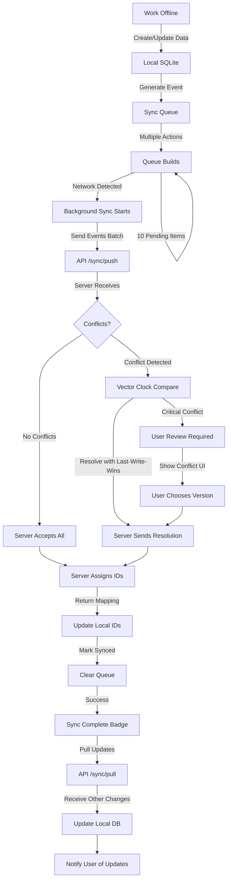
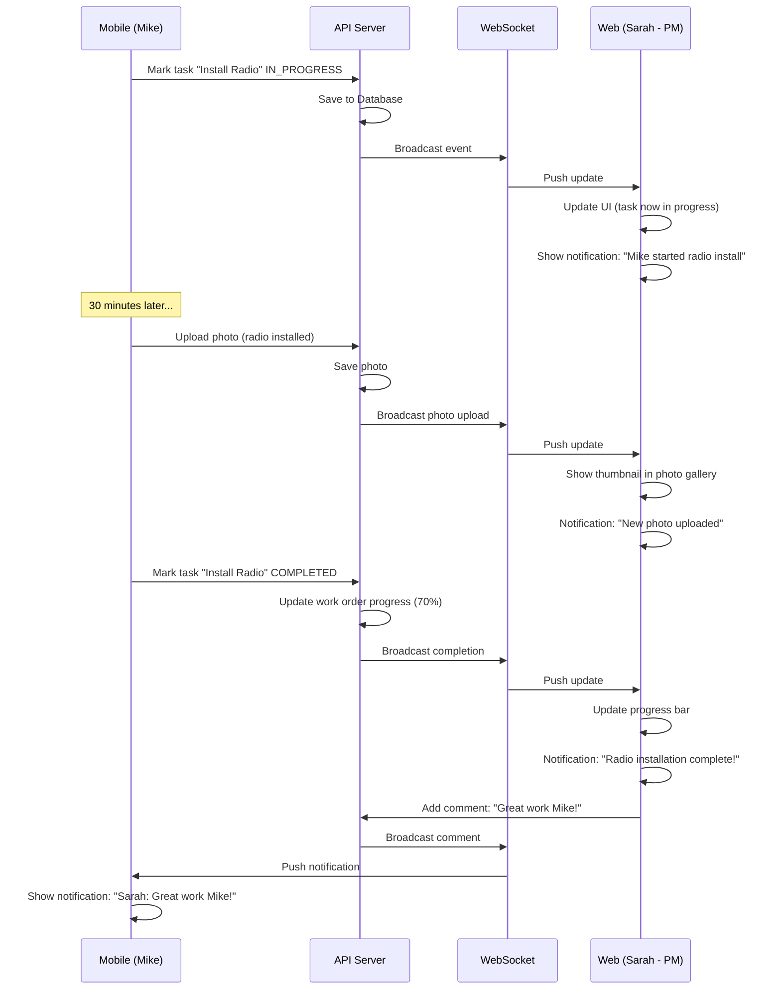

# TowerOS User Flows

**Detailed interaction flows for core workflows**

---

## Flow 1: Equipment Installation (Mobile)

**User:** Field Technician
**Context:** Installing a new radio on a tower
**Duration:** ~5 minutes
**Network:** Offline capable

```mermaid
graph TD
    A[Home Screen] -->|Tap Work Order| B[Work Order Detail]
    B -->|Tap "Install Alpha Radio" task| C[Equipment Installation Start]
    C -->|Option 1: Scan Barcode| D[Camera Scan Mode]
    C -->|Option 2: Manual Entry| E[Manual Equipment Form]

    D -->|Barcode Scanned| F[Equipment Identified]
    E -->|Form Filled| F

    F -->|Verify Details| G[Select Location]
    G -->|Choose Sector + Height| H[Take Before Photo]

    H -->|Photo Captured| I[Installation Checklist]
    I -->|Check: Torque Verified| I
    I -->|Check: Grounding OK| I
    I -->|Check: Cables Dressed| I
    I -->|All Checked| J[Take After Photo]

    J -->|Photo Captured| K[Take Label Photo]
    K -->|Photo Captured| L[Add Notes Optional]

    L -->|Tap "Complete Installation"| M{Network Available?}
    M -->|Yes| N[Sync to Server]
    M -->|No| O[Save Locally]

    N --> P[Success Confirmation]
    O --> P

    P -->|Tap "View Equipment"| Q[Equipment Detail Page]
    P -->|Tap "Install Another"| C
    P -->|Tap "Back to Work Order"| B
```

**Key Interactions:**
1. **Barcode scan** is fastest path (1 second)
2. **Photos required** - Cannot skip before/after
3. **Checklist enforced** - Safety critical items
4. **Offline graceful** - Works without network, syncs later
5. **GPS auto-captured** - Location stamped automatically

---

## Flow 2: Daily Work Start (Mobile)

**User:** Field Technician
**Context:** Arriving at site, starting work
**Duration:** ~2 minutes
**Network:** Offline capable

```mermaid
graph TD
    A[App Launch] -->|Biometric Auth| B[Home Screen]
    B -->|Auto-detect GPS| C{Near a Site?}

    C -->|Yes| D[Show Site Card: "North Tower Alpha nearby"]
    C -->|No| E[Show "Recent Sites" or "Navigate"]

    D -->|Tap Site Card| F[Site Detail]
    E -->|Tap Site| F

    F -->|View Active Work Order| G[Work Order Detail]
    G -->|Tap "Start Work"| H{Safety Briefing Required?}

    H -->|Yes - First Task| I[Safety Checklist]
    H -->|No - Resume| J[Task List]

    I -->|Check: JHA Reviewed| I
    I -->|Check: Weather OK| I
    I -->|Check: Rescue Plan| I
    I -->|Check: RF Awareness| I
    I -->|All Checked| J

    J -->|View Tasks| K[Select Task]
    K -->|Tap "Start Task"| L[Task Detail]

    L -->|Equipment Install| M[Equipment Flow]
    L -->|Testing| N[Testing Flow]
    L -->|Photos| O[Photo Flow]
```

**Key Interactions:**
1. **Biometric login** - Face ID/Touch ID (no typing)
2. **GPS auto-detection** - "You're near North Tower Alpha"
3. **Safety first** - Cannot skip safety checklist
4. **Smart resume** - Picks up where left off
5. **Weather alerts** - Automatic warnings for unsafe conditions

---

## Flow 3: Photo Documentation (Mobile)

**User:** Field Technician
**Context:** Documenting work with photos
**Duration:** ~30 seconds per photo
**Network:** Offline capable

```mermaid
graph TD
    A[Any Screen] -->|Tap Camera Quick Action| B[Photo Capture Mode]
    A -->|From Task: "Take Photo"| B
    A -->|From Equipment: "Add Photo"| B

    B -->|Camera Viewfinder Open| C{Context Known?}
    C -->|Yes - From Task/Equipment| D[Auto-tag Context]
    C -->|No - Quick Action| E[Manual Category Select]

    D --> F[Take Photo]
    E --> F

    F -->|Capture Button| G[Photo Preview]
    G -->|Verify Quality| H{Photo Good?}

    H -->|No| I[Retake]
    I --> F

    H -->|Yes| J[Review/Edit]
    J -->|Add Caption Optional| J
    J -->|Adjust Category| J
    J -->|Confirm| K{Network Available?}

    K -->|Yes| L[Upload + Sync]
    K -->|No| M[Save Locally]

    L --> N[Photo Saved]
    M --> N

    N -->|Return to Context| O[Back to Task/Equipment/Site]
```

**Key Interactions:**
1. **One-tap from anywhere** - Camera always accessible
2. **Auto-tagging** - Smart context detection
3. **GPS + timestamp** - Automatic metadata
4. **Offline storage** - Photos saved locally, synced later
5. **Thumbnail generation** - Instant preview, full-res uploaded

---

## Flow 4: Offline Sync Reconciliation (Mobile)

**User:** Field Technician
**Context:** Returning from tower (offline) to truck (online)
**Duration:** Automatic, background
**Network:** Requires connectivity



**Key Interactions:**
1. **Transparent** - User doesn't trigger sync, it happens automatically
2. **Background** - Doesn't block user workflow
3. **Conflict resolution** - Automatic where possible
4. **Progress indicator** - Subtle badge shows sync status
5. **Bi-directional** - Push local changes, pull remote updates

---

## Flow 5: Work Order Management (Web Dashboard)

**User:** Project Manager
**Context:** Assigning work orders to crews
**Duration:** ~3 minutes per work order
**Network:** Required

```mermaid
graph TD
    A[Dashboard] -->|Click "Work Orders"| B[Work Order List]
    B -->|Click "Create Work Order"| C[New Work Order Form]

    C -->|Select Site| D[Site Dropdown]
    D -->|Choose "North Tower Alpha"| E[Auto-load Site Context]

    E -->|Enter Title| F["Install 5G NR Equipment"]
    F -->|Select Work Type| G[Dropdown: "Modernization"]
    G -->|Set Dates| H[Date Picker]
    H -->|Select Crew| I[Crew Dropdown: "Crew Delta"]

    I -->|Estimate Cost| J[Enter $15,000]
    J -->|Add Tasks| K[Task Builder]

    K -->|Add: "Safety Briefing"| K
    K -->|Add: "Install Alpha Antenna"| K
    K -->|Add: "Install Alpha Radio"| K
    K -->|Add: "PIM Testing"| K
    K -->|Sequence Tasks| L[Drag to Reorder]

    L -->|Assign Equipment| M[Link Equipment IDs]
    M -->|Upload Drawings| N[Document Upload]

    N -->|Review| O[Preview Work Order]
    O -->|Click "Create"| P[Save to Database]

    P -->|Success| Q[Work Order Created]
    Q -->|Notify Crew| R[Push Notification]
    R -->|Crew Leader: "New work assigned"| S[Mobile App Update]

    Q -->|Real-time Update| T[Dashboard Refreshes]
```

**Key Interactions:**
1. **Site context** - Auto-loads relevant info
2. **Task builder** - Drag-and-drop sequencing
3. **Real-time notifications** - Crew immediately notified
4. **Document attach** - Drawings linked upfront
5. **Equipment pre-assignment** - Reduces field confusion

---

## Flow 6: Site Timeline (Web Dashboard)

**User:** Project Manager or Inspector
**Context:** Reviewing complete site history
**Duration:** Variable (investigation/audit)
**Network:** Required

```mermaid
graph TD
    A[Site Detail Page] -->|Click "Timeline" Tab| B[Load Event Log]
    B -->|Query Events API| C[Fetch All Site Events]

    C -->|Filter by Date Range| D{Apply Filters?}
    D -->|Yes| E[Date Picker: "March 1-31, 2026"]
    D -->|No| F[Show All Events]

    E --> G[Filtered Events]
    F --> G

    G -->|Display Chronologically| H[Timeline View]

    H -->|Event 1| I["SITE_CREATED - Jan 15, User: Sarah"]
    H -->|Event 2| J["EQUIPMENT_INSTALLED - Mar 20, User: Mike"]
    H -->|Event 3| K["TEST_PERFORMED - Mar 20, User: Mike"]
    H -->|Event 4| L["INSPECTION_COMPLETED - Mar 21, User: Inspector"]

    I -->|Click Event| M[Event Detail Modal]
    M -->|Show Full Payload| N[JSON Preview]
    M -->|Show Photos| O[Related Photos]
    M -->|Show User| P[User Profile Link]

    H -->|Filter by Type| Q[Checkbox: "Equipment Only"]
    Q --> R[Filtered Timeline]

    H -->|Search| S[Text Search: "PIM test"]
    S --> T[Matching Events]

    H -->|Export| U[Generate PDF Report]
    U --> V[Download Timeline Report]
```

**Key Interactions:**
1. **Complete audit trail** - Every action logged
2. **Time-travel** - "What happened on March 20?"
3. **Filterable** - By date, type, user, equipment
4. **Searchable** - Full-text search across events
5. **Exportable** - PDF for compliance/closeout

---

## Flow 7: Real-Time Collaboration (Web + Mobile)

**User:** PM (Web) + Technician (Mobile)
**Context:** Live progress updates
**Duration:** Continuous during work
**Network:** Required (WebSocket)



**Key Interactions:**
1. **Instant updates** - No refresh needed
2. **Presence awareness** - See who's working on what
3. **Bidirectional** - Field ↔ Office communication
4. **Notifications** - Non-intrusive, contextual
5. **Activity feed** - Complete timeline visible

---

## Flow 8: Equipment Search & Discovery (Web)

**User:** Project Manager or Inventory Manager
**Context:** Finding specific equipment across sites
**Duration:** ~1 minute
**Network:** Required

```mermaid
graph TD
    A[Dashboard] -->|Global Search| B[Search Bar]
    B -->|Type: "AIR 6449"| C[Live Search Results]

    C -->|Show Categories| D[Equipment: 15 results]
    D -->|Show Categories| E[Sites: 8 results]
    D -->|Show Categories| F[Work Orders: 3 results]

    C -->|Click Equipment Result| G[Equipment List Filtered]

    G -->|Result 1| H[AIR 6449 - North Alpha - In Service]
    G -->|Result 2| I[AIR 6449 - South Beta - In Service]
    G -->|Result 3| J[AIR 6449 - East Gamma - Ordered]

    H -->|Click| K[Equipment Detail Page]

    K -->|Advanced Filter| L[Filter Panel]
    L -->|Status: In Service| M[Apply Filter]
    L -->|Installed After: Jan 2026| M
    L -->|Sector: Alpha| M

    M --> N[Refined Results: 3 matches]

    N -->|Bulk Actions| O[Select Multiple]
    O -->|Export to CSV| P[Download Equipment Report]
    O -->|Schedule Maintenance| Q[Batch Maintenance Creation]
```

**Key Interactions:**
1. **Global search** - Available from anywhere
2. **Multi-type results** - Equipment, sites, work orders
3. **Live results** - As-you-type filtering
4. **Advanced filters** - Drill down precisely
5. **Bulk operations** - Act on multiple items

---

## Interaction Design Principles

### 1. Progressive Disclosure
- Show most important info first
- Hide complexity until needed
- Expand/collapse details

### 2. Contextual Actions
- Relevant actions appear in context
- No generic "Actions" menu
- Quick actions always visible

### 3. Optimistic UI
- Immediate feedback
- Assume success
- Handle errors gracefully

### 4. Undo/Redo
- Accidental deletions recoverable
- "Undo" toast after destructive action
- 5-second window to undo

### 5. Accessibility
- VoiceOver/TalkBack support
- High contrast mode
- Large text support
- Keyboard navigation (web)

---

## Performance Targets

### Mobile
- **Screen load:** < 300ms
- **Action response:** < 100ms (optimistic)
- **Photo capture:** Instant
- **Barcode scan:** < 2 seconds

### Web
- **Page load:** < 1 second
- **Search results:** < 200ms
- **WebSocket latency:** < 100ms
- **Map render:** < 500ms

---

## Next Steps

1. ✅ User flows documented
2. ⏳ Interactive prototypes (Figma)
3. ⏳ Usability testing with field techs
4. ⏳ Design system finalization
5. ⏳ Component library implementation

---

**These user flows ensure TowerOS is intuitive, fast, and designed around how technicians actually work in the field.**
